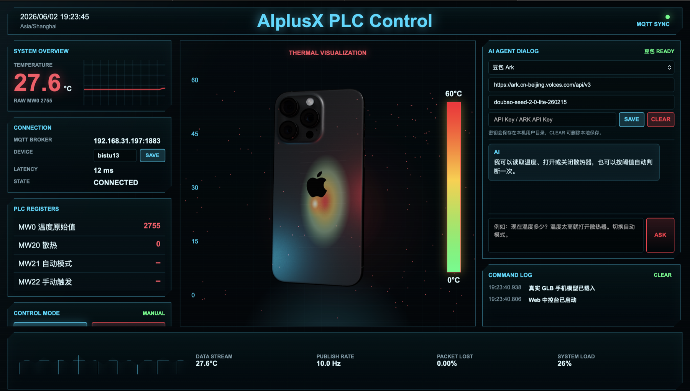

# AIplusXController



AIplusXController 是一个用于 AI+X 实验的本地 PLC 控制系统。项目用 Python 通过 MQTT 读取和写入 PLC 变量，并提供一个赛博朋克风格 Web 中控台，让用户可以查看温度、切换自动/手动模式、控制散热器，并通过 AI Agent 对话框使用自然语言完成控制。

本项目用于替代 Dify 不可用时的实验方案：由本地脚本和 WebUI 实现 AI Agent 控制 PLC。

## 功能

- 通过 MQTT 读取 PLC 温度变量 `MW0`，温度值按 `MW0 / 100` 计算。
- 手动控制散热器，按实验要求写入 `MW20` 和 `MW22`。
- 自动控制模式，根据温度阈值写入 `MW21` 和 `MW20`。
- Web 中控台展示实时温度、PLC 寄存器、连接信息和命令日志。
- 3D 手机热力可视化，根据温度展示背板热感应效果。
- AI Agent 对话框支持自然语言读取温度、打开/关闭散热器、执行自动判断。
- AI 配置支持 OpenAI、豆包 Ark 和自定义 OpenAI-compatible 接口。
- API Key 和 MQTT device 号可在 WebUI 中配置，并保存到本机用户目录。
- 支持 `--mock` 模拟模式，未连接真实 PLC 时也能演示和测试界面。

## PLC 变量映射

默认 MQTT broker:

```text
192.168.31.197:1883
```

默认设备号:

```text
bistu13
```

默认 MQTT topic:

```text
读取: bistu13/TagValues
写入: bistu13/MQTTSetValueCommand/1
```

| 功能 | PLC 变量 | 说明 |
| --- | --- | --- |
| 温度 | `MW0` | 读取原始值后除以 100 得到温度 |
| 散热 | `MW20` | `1` 开启散热，`0` 关闭散热 |
| 自动模式 | `MW21` | `1` 自动模式，`0` 手动模式 |
| 手动触发 | `MW22` | 手动控制触发位 |

示例上报数据：

```json
[{"Cache": false, "DeviceSN": "bistu13", "TagData": [{"MW0": 2721}]}]
```

示例写入数据：

```json
[{"DeviceSN": "bistu13", "TagData": [{"MW20": 1, "MW22": 1}]}]
```

## 写入规则

### 自动模式

点击 WebUI 中的 `AUTO` 或通过 AI Agent 执行自动判断时：

1. 写入 `MW21 = 1`
2. 读取温度
3. 温度大于等于开启阈值时写入 `MW20 = 1`
4. 温度小于等于关闭阈值时写入 `MW20 = 0`
5. 温度位于回差区间时保持当前散热状态

默认阈值：

```text
开启散热: 30.0 C
关闭散热: 28.0 C
```

### 手动模式

点击 `MANUAL` 时：

```text
MW21 = 0
```

手动开启散热时：

```text
MW21 = 0
MW20 = 1
MW22 = 1
```

手动关闭散热时：

```text
MW21 = 0
MW22 = 0
MW20 = 0
MW22 = 1
```

## 安装

推荐使用 conda：

```bash
cd /Users/wang/Documents/projects/AIplusX
conda env create -f environment.yml
```

如果环境已经创建过：

```bash
conda activate aiplusx-plc
pip install -r requirements.txt
```

也可以直接使用 `conda run`，不手动 activate。

## 配置

可以复制环境变量示例文件：

```bash
cp .env.example .env
```

常用配置项：

```env
MQTT_HOST=192.168.31.197
MQTT_PORT=1883
MQTT_DEVICE_SN=bistu13
MQTT_USERNAME=bistu13
MQTT_PASSWORD=bistu13
TEMP_ON_C=30
TEMP_OFF_C=28
```

如果没有设置 `MQTT_DEVICE_SN` 环境变量，WebUI 中保存的 device 号会自动生效。

WebUI 保存的 PLC 配置文件位于：

```text
~/.aiplusx_plc_agent/plc_config.json
```

AI API Key 配置文件位于：

```text
~/.aiplusx_plc_agent/ai_config.json
```

这两个文件只保存在本机，不会被提交到仓库。

## 运行 Web 中控台

连接真实 MQTT/PLC：

```bash
cd /Users/wang/Documents/projects/AIplusX
conda run -n aiplusx-plc python -m aiplusx_plc_agent web --host 127.0.0.1 --port 8067
```

打开浏览器：

```text
http://127.0.0.1:8067/
```

未连接 PLC 时使用模拟模式：

```bash
conda run -n aiplusx-plc python -m aiplusx_plc_agent web --host 127.0.0.1 --port 8067 --mock
```

模拟模式会生成温度变化，并模拟 `MW0`、`MW20`、`MW21`、`MW22` 状态，适合演示和调试 WebUI。

## WebUI 使用说明

### CONNECTION

显示 MQTT broker、device、延迟和连接状态。

可以直接修改 `DEVICE` 输入框并点击 `SAVE`。保存后会写入本地配置文件，下次启动自动读取。

### CONTROL MODE

- `MANUAL`: 切换手动模式，写入 `MW21 = 0`
- `AUTO`: 执行一次自动判断，写入 `MW21 = 1`

自动模式下，手动散热按钮会被禁用。

### MANUAL CONTROL

- `散热 ON`: 手动打开散热器
- `散热 OFF`: 手动关闭散热器

### AI AGENT DIALOG

可以输入自然语言，例如：

```text
现在温度多少？
打开散热器
关闭散热器
温度太高就自动判断一次
切换自动模式
```

AI 对话支持流式输出。未配置 API Key 时，会使用本地规则识别常见命令。

### AI Provider 配置

支持：

- OpenAI
- 豆包 Ark
- Custom OpenAI-compatible API

豆包 Ark 默认配置：

```text
Base URL: https://ark.cn-beijing.volces.com/api/v3
Model: doubao-seed-2-0-lite-260215
```

填写 API Key 后点击 `SAVE`，会保存到本地用户目录。点击 `CLEAR` 可清除本地保存。

## 命令行用法

读取状态：

```bash
conda run -n aiplusx-plc python -m aiplusx_plc_agent status
```

手动打开散热：

```bash
conda run -n aiplusx-plc python -m aiplusx_plc_agent manual-on
```

手动关闭散热：

```bash
conda run -n aiplusx-plc python -m aiplusx_plc_agent manual-off
```

执行一次自动判断：

```bash
conda run -n aiplusx-plc python -m aiplusx_plc_agent auto-once
```

持续自动控制：

```bash
conda run -n aiplusx-plc python -m aiplusx_plc_agent auto --on 30 --off 28 --interval 2
```

交互式文本控制：

```bash
conda run -n aiplusx-plc python -m aiplusx_plc_agent chat
```

## 测试

```bash
conda run -n aiplusx-plc python -m unittest discover -s tests -v
```

前端脚本语法检查：

```bash
node --check web/static/app.js
```

Python 编译检查：

```bash
conda run -n aiplusx-plc python -m compileall aiplusx_plc_agent tests
```

## 注意事项

- 如果端口 `8067` 被占用，请先关闭已有 Web 服务，或换一个端口。
- 真实 PLC 控制时不要使用 `--mock`。
- API Key 只保存在本机用户目录，仓库不会提交密钥。
- 如果设置了环境变量 `MQTT_DEVICE_SN`，它会优先于 WebUI 保存的 device 号。
- WebUI 使用 Three.js CDN 加载 3D 渲染依赖，首次打开需要可访问外网或相应 CDN。
